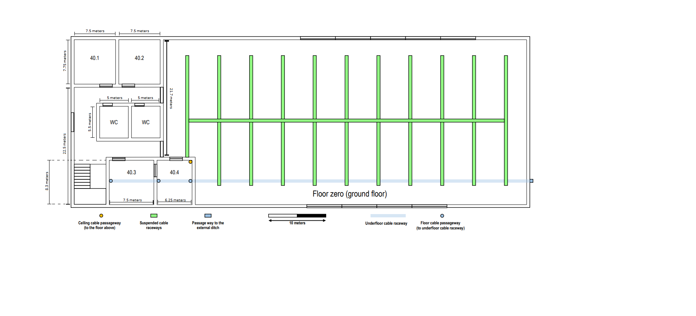
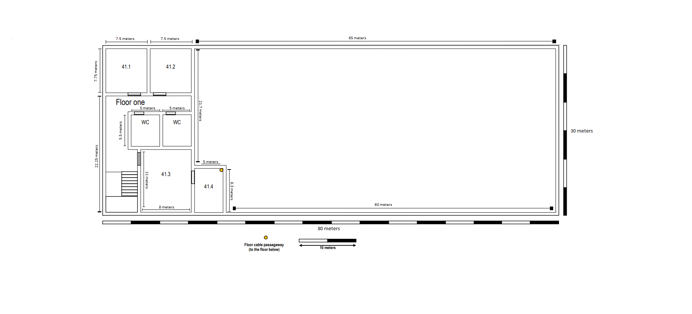
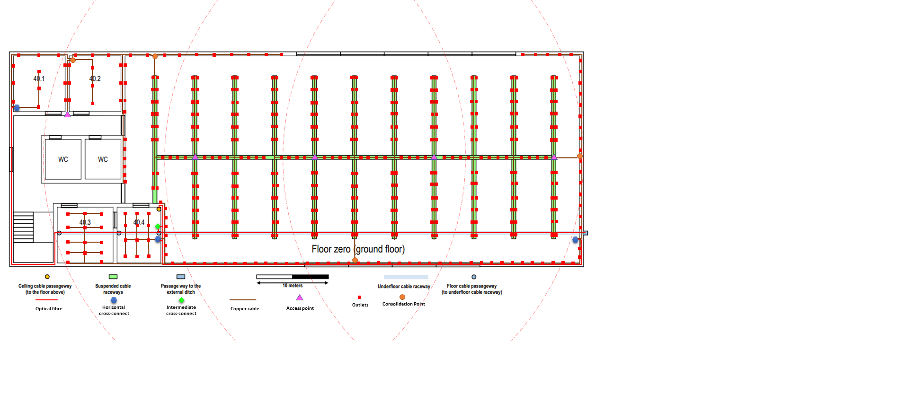
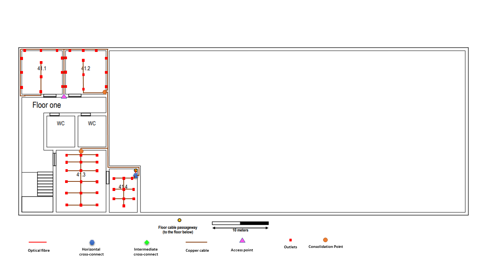

RCOMP 2020-2021 Project - Sprint 1 - Member 1190718 folder
===========================================

The owner of this folder (member number 1190718) will commit here all the outcomes (results/artifacts/products) of his/her work during sprint 1. This may encompass any kind of standard file types.

# Building 4 #

Important notes:
	
Both floors should have wireless LAN coverage (Wi-Fi).  

## Ground floor: 



### Sizes:
	
* 80x30m
		
* Left area Ceiling height = 3 meters (2.5 meters with removable dropped ceiling)

* Right side open area ceiling height = 6.5 meters 
		
Ground floor has underfloor cable raceway connected tot the external technical ditch.
	
There's a grid of suspended communications cable raceways (represented in green at the previous picture) placed 3 meters from the ground. 

### Common area: 

* Both WCs

* Stairs hallway
	
Common areas are not required to have network outlets.

### Area measurements:

* 40.1 	= 7.5 X 7.75 = 58.125 m2

* 40.2 = 7.5 X 7.75 = 58.125 m2

* 40.3 = 7.5 X 8.3 = 62.25 m2

* 40.4 = 6.25 X 8.3 = 51.875 m2

* Right side Area = (5 X 21.7) + (60 * 30) = 1908.5 m2

## Floor 1:



### Sizes:
	
* Left area ceiling height = 3 meters (2.5 meters with removable dropped ceiling)
		
### Common area: 

* Both WC's

* Stairs hallway
	
Common areas are not required to have network outlets.

### Area measurements:

* 41.1 	= 7.5 X 7.75 = 58.125 m2

* 41.2 = 7.5 X 7.75 = 58.125 m2

* 41.3 = 8 X 11 = 88 m2

* 41.4 = 5 X 8.3 = 41.5 m2

## Standard outlets needed per area:  

Note: 2 outlets per 10 m2

***Ground floor***:

**40.1** → 12 outlets 

**40.2** → 12 outlets

**40.3** → 14 outlets 

**40.4** → 12 outlets

**Open area** → 386 outlets

**Floor One**:

**41.1** → 12 outlets

**41.2** → 12 outlets

**41.3** → 18 outlets

**41.4** → 10 outlets

## Cabling plant
**Ground floor**:



**Floor one**:



## Measurements

| **Floor**       | **Fibre(meters)**     |
| :------------- | :----------:|
| Ground floor |   171|
| Floor transition |  3|
| Floor one |   0,5|
|||
| TOTAL |   174,5|

###### **_Note:_** On the floor transition are used 3 meters of fibre trough the ground.

| **Room**       | **Copper(meters)**     |
| :------------- | :----------| 
|   40.1.    |  99 |
|  40.2. |  61  |
| 40.3.   | 275,5 |
| 40.4.   | 35 |
|||
| TOTAL |   470,5|

| **Room**       | **Copper(meters)**     |
| :------------- | :----------| 
|   Open area   |  6100 |
|||
| TOTAL |   6100|

| **Room**       | **Copper(meters)**     |
| :------------- | :----------| 
|   41.1.    |  274 |
|  41.2. |  94  |
| 41.3.   | 98|
| 41.4.   | 36 |
|||
| TOTAL |   502|

| **Floor(HC -> CP)**       | **Copper(meters)**     |
| :------------- | :----------| 
|   Ground floor   | 246|
|  First floor |  35,5  |
|||
| TOTAL |   281,5|

| **Floor(CP -> AP)**       | **Copper(meters)**     |
| :------------- | :----------| 
|   Ground floor   | 60,5 |
|  First floor |  20,5  |
|||
| TOTAL |   81|

## Inventory

| **Name**       | **Quantity**     | **Justification**   |
| :------------- | :----------| :----------| 
|  IC(Intermediate cross-connect)   | 1 | "One IC for each building"-rule.|
|  HC(Horizontal cross-connect) |  4  | Area covered by each HC should always be less than 1000m².  |
|  CP(Consolidation Point)   | 6 | In this building CPs are placed in strategic positions so that the amount of copper cable used is decreased.|
|  AP(Access Point)  | 6 | The number of APs in this building exceeds the necessary considering the covered area. More Aps are placed in order to provide better connection quality for each user.
|  Outlets(RJ45)   | 488 | "Two outlets must be placed for each 10m² "-rule.|
|  Switches(24-ports)  | 7   | Total number of switches placed in Ics, Hcs and CPs.      |
|  Switches(48-ports)  | 9   |  Total number of switches placed in Ics, Hcs and CPs.     |
|  Patch panels(24-ports) |  7   |  Total number of patch panels placed in Ics, Hcs and CPs.  |
|  Patch panels(48-ports) |  9   | Total number of patch panels placed in Ics, Hcs and CPs.   |
|  Fibre Cable | 174,5m | Total length needed of optical fibre. The amount of fibre bought should be more than the necessary in case of small errors in calculations or in case of any accident while structuring cables.|
|  Copper Cable | 7435m | Total length needed of copper cable. The amount of copper cable bought should be more than the necessary in case of small errors in calculations or in case of any accident while structuring cables.| |
|  Fibre cables  |  5 cables    |  Number of cables necessary.     |
|  Copper cables  |   504 cables   |  Number of cables necessary.     |

## Cabling

The cable we are using is CAT6 RJ45. There are more type of cables but also more expensive. In this Sprint, CAT6 RJ45 is perfect. In the entire project it has the T568A pattern.
 



