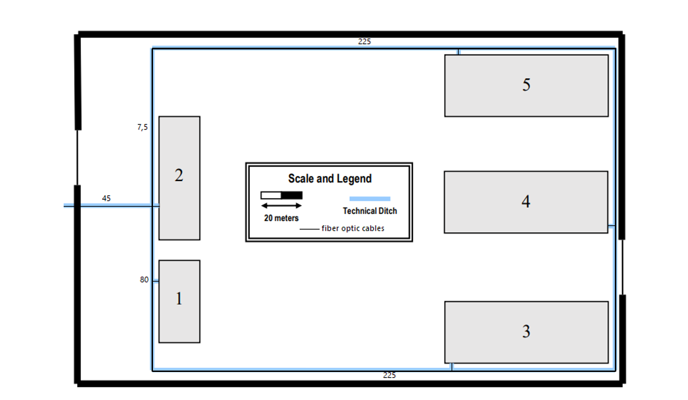
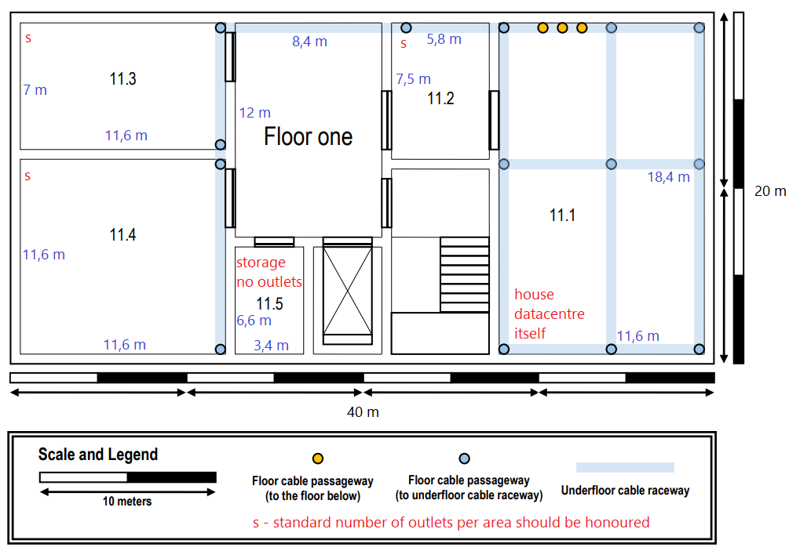
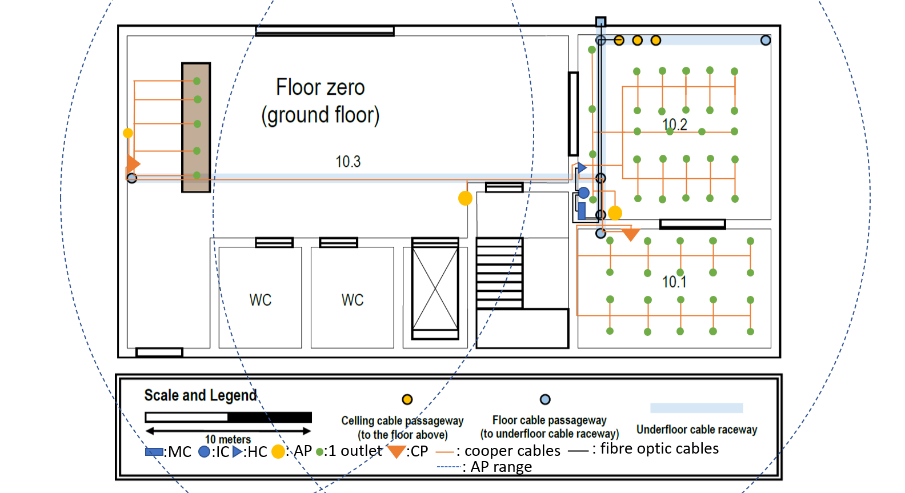
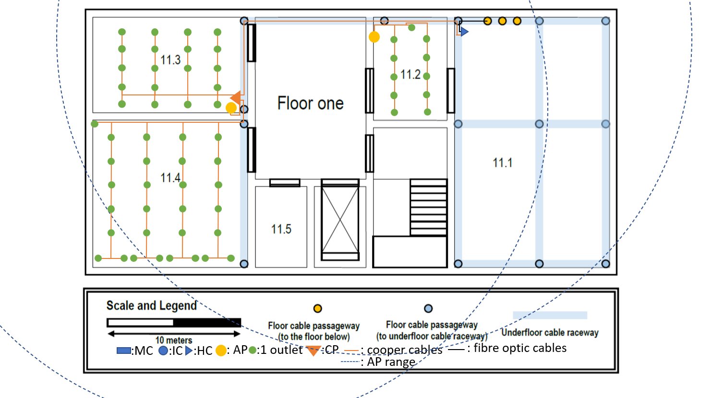

RCOMP 2020-2021 Project - Sprint 1 - Member 1190782 folder
===========================================
The owner of this folder (member number 1190782) will commit here all the outcomes (results/artifacts/products)		       of his/her work during sprint 1. This may encompass any kind of standard file types.
-------------------------------------------------------------------------
José Miguel Monteiro Soares

The outside has an underground technical ditch with cable raceways (in light blue) and includes cable passage ways for all buildings. Thus, we can use fiber optic cables to give telecommunications cables to other buildings:

For better telecommunications connection between all the buildings we will connect all of them to each other. Thus, if some cable break, all buildings will have the telecommunications connection anyway.

To this we need to connect the following buildings:

The main cables:

A->B
A->C
A->D
A->E

The support cables:

B->C
C->D
D->E
E->A

Note: This cables let every building be safe about any break that could happen in one of the main cables.

Total: 1600 m rounded in case of some constructions errors

## Building 1 ##

Building 1 is commited to house the datacentre. It will also house the main cross-connect for the structured cabling system. 

Cause of building 1 has the MC (main cross-connect) there will be connections to the other buildings from the building 1. Thus we will use fiber optic cables to share the information to the other buildings.
	
Both floors should have wireless LAN coverage (Wi-Fi).  

Floor 0:

Sizes:
	
* 40x20m
		
* Ceiling height = 4 m
		
Ground floor has underfloor cable raceway connected tot the external technical ditch.
	
Multiple cable passageways are available to the above floor where the datacentre is housed.

10.3 entrance -> no network except for entrance desk (brown): 5 outlets should be available
	
Other rooms the standard number of outlets per area should be honoured.  

Floor 1:

Has an underfloor cable raceway. 
	
Sizes:
	
* Ceiling height = 3 m
		
11.1 area -> will house the datacentre itself. Wiring and outlets are out of scope of this project.
	
11.5 for storage and no outlets.
	
Other rooms the standard number of outlets per area should be honoured.

#### Rooms Area Measurements: ####
	
Total area: 40 * 20 =  800 m^2

**Floor 0**:

**10.1** area → (7 * 11,6) = 81,2 m^2

**10.2** area → (10,8 * 11,6) = 125,28 m^2

**10.3** area → (5 * 6,6) + (27,4 * (9,2 + 3,75)) - (3,75 * 6,25) = 364,4 m^2

**WC**'s area → (5,8 * 5) = 29 m^2

**Floor 1**: 

**11.1** area → (11,6 * 18,4) = 213.44 m^2

**11.2** area → (5,8 *	7,5) = 43,5 m^2

**11.3** area → (7 * 11,6) = 81,2 m^2

**11.4** area → (11,6 * 11,6) = 134,56 m^2

**11.5** area → (6,6 * 3,4) = 22,44 m^2

##### Standard outlets needed per area:  

Note: 2 outlets per 10 m^2

Outlet needed: (area * 2) / 10 

**Floor 0**:

**10.1** → 18 outlets + 2 outlets for future upgrades

**10.2** → 26 outlets + 2 outlets for future upgrades

**10.3** → 5 outlets (only needed for brown desk) 

**WC** → 0 outlets, no outlets needed in WC

**Floor 1**:

**11.1** → 0 outlets

**11.2** → 9 outlets + 2 outlets for future upgrades

**11.3** → 17 outlets + 2 outlets for future upgrades

**11.4** → 27 outlets + 2 outlets for future upgrades

**11.5** → 0 outlets

##### Structured cabling

The building 1 is committed to house the datacentre, it will also house the main cross-connect for the 
structured cabling system.

In building 1:

* 1 MC (Main cross-connect)
* 1 IC (Intermediate cross-connect)
* 1 HC (Horizontal cross-connect) **per floor**
* 5 AP (Access Point)
* 3 CP (Consolidation Point)
* 112 outlets (according to the areas)

##### Cabling

The cable we are using is CAT6 RJ45. There are more type of cables but also more expensive. In this Sprint, CAT6 RJ45 is perfect. In the entire project it has the T568A pattern.
 
##### Explanation of wiring decisions

Floor 0:

**Important**: All coper and fibre optic cables that are not in a underfloor cable raceway are covered by a cable raceway so they are not visible.

This HC has 1 patch pannel and 1 switch each one with 32 ports so it can distribute cooper cables to everything needed.

In this floor we receive the telecommunications fibre optic cable from the outside. We need to connect it to MC (main cross-connect). After that we connect it to IC (intermediate cross-connect) and also to HC (horizontal cross-connect) making the following connections: (MC->IC->HC). After this we can already distribute to the other rooms. We need to send a cable from IC to the first ceilling cable passageway (to the floor above) making the following connection (IC->HC(floor one)). 
The cooper that comes out from HC will be distributed to all the rooms that need outlets or CP through the underfloor cable raceway to the floor cable passageway. There we can take all cables we need.

In case of room **10.1** we take the cooper cable from HC and connect it to a CP that has 1 switch and 1 patch pannel each one with 20 ports. In this room we will need 20 outlets. After that we can use 20 copper cables comming from CP to connect to all the 20 outlets needed. We used a CP in room 10.1 to reduce the number of cooper cables comming from HC.
In case of room **10.2** we take the cooper cable from HC and connect to every outlet needed. In this room we will need 28 outlets so we need a 30 ports switch and a 30 ports patch pannel. After that we can use 28 copper cables comming from HC to connect all the 28 outlets needed.
In case of room **10.3** we take the cooper cable from HC cable and connect to the CP located close to the desk. This CP has a 6 ports patch pannel and a 6 ports switch. In this room we will only need 5 outlets to the brown desk and also 2 more AP so we can garant that everybody has good WI-FI signal. Thus, we will need a 6 ports switch. After that we can use 5 copper cables coming from CP to connect all the 5 outlets needed and 1 AP. After that we will need other cable from comming from HC to the AP located in a wall closed to the stairs.

In this floor we use 3 AP so we get WI-FI in every part of the floor and distribute all the good quality signal for everybody. 

Floor 1:

**Important**: All coper and fibre optic cables that are not in a underfloor cable raceway are covered by a cable raceway so they are not visible.

This HC has 1 patch pannel and 1 switch each one with 32 ports so it can distribute cooper cables to everything needed.

In this floor we receive the telecommunications fibre optic cable from the lower floor comming from IC. We need to connect it to HC. After that we can already distribute to the other rooms. 
To distribute the cooper cable from HC we need to send them through the underfloor cable raceway to the floor cable passageway. There we can take the cables we need. 

In case of room **11.1** we won't have any outlet and no AP because 11.1 is just a storage room.
In case of room **11.2** we are having 12 cooper cables coming from HC. Thus, 11 cables coming from HC will be used to connect all the outlets and 1 cable to the AP. 
In case of room **11.3** we take a cooper cable from HC and send it through the underfloor cable raceway. In the room we take the cooper cable and connect it to a CP. This CP has 2 patch pannels and 2 switches, 1 patch pannel and 1 switch with 20 ports and other patch pannel and other switch both with 30 ports. After that we will need 20 copper cable coming from the CP. 1 for the AP and the other 19 for outlets.
In case of room **11.4** we will need 29 cooper cables comming from 11.3 CP to connect all the outlets.

In this floor we use 2 AP so we get WI-FI in every part of the floor and distribute all the good quality signal for everybody. 

##### Tota cable needed:

Floor zero: 

* Fibre optic: 42,6 ~ round to 45 m in case of some constructions errors
* Cooper: 743,29 ~ round to 745 m in case of some constructions errors

Floor one:

* Fibre optic: 3,03 ~ round to 5 m in case of some constructions errors
* Cooper: 715,28 ~ round to 720 m in case of some constructions errors

### Inventory:

* Fibre optic : 1650 m (with outside area)	
* Cooper : 1465 m
* 1 x MC (Main cross-connect)
* 1 x IC (Intermediate cross-connect)
* 2 x HC (Horizontal cross-connect)
* 5 x AP (Access Point)
* 3 x CP (Consolidation Point)
* 112 x outlet
* 2 x switch : 20 ports
* 2 x patch pannel : 20 ports
* 1 x switch : 32 ports
* 1 x patch pannel : 32 ports
* 1 x switch : 6 ports
* 1 x patch pannel : 6 ports
* 1 x switch : 14 ports
* 1 x patch pannel : 14 ports
* 1 x switch : 30 ports
* 1 x patch pannel : 30 ports