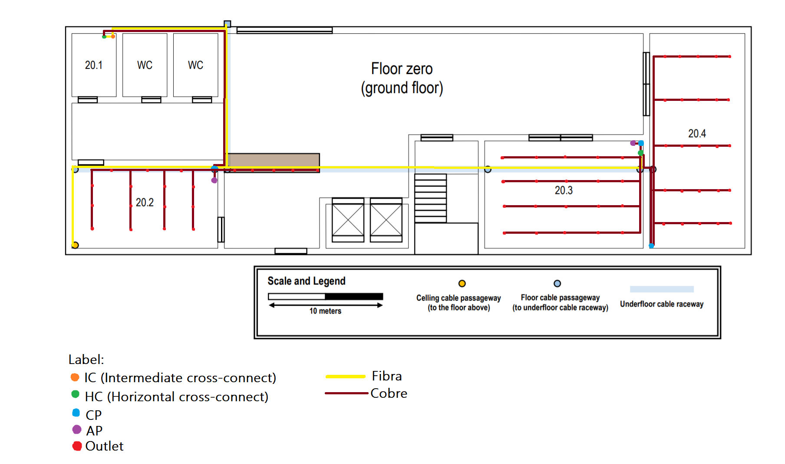

RCOMP 2020-2021 Project - Sprint 1 - Member 1190811 folder
===========================================

Building 2
-------------------------------------

-------------------------------------
##Ground Floor


#Cabbles Measurments

================================
Fiber
================================
* 20.1(inside):
* 12 meters (IC)
* 2 meters (HC)
* 14 meters (come back way)
* 20.1(outside):
* 13 meters ((1HC))+(2x HC Fiber going to the first floor)

* 20.2 :
* 20 meters (2 HC going to the first floor) x 2

* (Outside)
* 37 meters (1 HC)

##TOTAL FIBRA = 144 meters of fiber on the floor


================================
Copper
================================
* (OUTSIDE)
* 14 meters (backwards way)
* 13 meters (1 CP)

* 1 meters (1CP)
* 10 meters(1CP)

 Total Cobre in CP's= 38 meters 
---------------------------
* 20.2:(counting from the top right side to the left)
* 2 meters (para o AP)
* 5 meters (1º outlet)
* 7 meters (2º outlet)
* 10 meters (3º outlet)
* 4 meters (4º outlet)
* 7 meters (5º outlet)
* 9 meters (6º outlet)
* 12 meters (7º outlet)
* 7 meters (8º outlet)
* 10 meters (9º outlet)
* 12 meters (10º outlet)
* 15 meters (11º outlet)
* 10 meters (12º outlet)
* 14 meters (13º outlet)
* 16 meters (14º outlet)
* 19 meters (15º outlet)

TOTAL COPPER 20.2 = 159 meters 
------------------
* DESK:
* (Beggining 3 meters getting out of the cp)
* 3 meters (1º outlet)
* 5 meters (2º outlet)
* 7 meters (3º outlet)
* 9 meters (4º outlet)
* 13 meters (5º outlet)

TOTAL COPPER DESK = 37 meters 
---------------------------
* 20.3:
* (2 meters getting out of the cp)
* 4 meters (1º outlet) 
* 7 meters (2º outlet) 
* 9 meters (3º outlet)
* 12 meters (4º outlet)
* 15 meters (5º outlet)

TOTAL COPPER 20.3.a = 47 meters 
----------------------
* (5 meters getting out of the cp)
* 7 meters (6º outlet) 
* 9 meters (7º outlet) 
* 12 meters (8º outlet)
* 15 meters (9º outlet)
* 18 meters (10º outlet)

TOTAL COPPER 20.3.b = 61 meters 
----------------------
* (8 meters getting out of the cp)
* 10 meters (11º outlet)
* 13 meters (12º outlet)
* 16 meters (13º outlet)
* 19 meters (14º outlet)
* 22 meters (15º outlet)

TOTAL COPPER 20.3.c = 80 meters 
-----------------------
* (11 meters getting out of the cp)
* 13 meters (16º outlet)
* 16 meters (17º outlet)
* 19 meters (18º outlet)
* 22 meters (19º outlet)
* 25 meters (20º outlet)

TOTAL COPPER 20.3.d = 95 meters 
-----------------------------
* 20.4:
* (2 meters getting out of the cp)
* 4 meters (21º outlet)
* 6 meters (22º outlet)
* 8 meters (23º outlet)
* 10 meters (24º outlet)
* 12 meters (25º outlet)

TOTAL COPPER 20.4.a = 40 meters 
---------------------
* (5 meters getting out of the cp)
* 7 meters (26º outlet)
* 9 meters (27º outlet)
* 11 meters (28º outlet)
* 13 meters (29º outlet)
* 15 meters (30º outlet)

TOTAL COPPER 20.4.b = 55 meters 
------------------------
* (9 meters getting out of the cp)
* 11 meters (31º outlet)
* 13 meters (32º outlet)
* 15 meters (33º outlet)
* 17 meters (34º outlet)
* 19 meters (35º outlet)

TOTAL COPPER 20.4.c = 75 meters 
-----------------------
* (13 meters getting out of the cp)
* 15 meters (36º outlet)
* 17 meters (37º outlet)
* 19 meters (38º outlet)
* 21 meters (39º outlet)
* 23 meters (40º outlet)

TOTAL COPPER 20.4.d = 95 meters 
-----------------------
* (17 meters getting out of the cp)
* 19 meters (41º outlet)
* 21 meters (42º outlet)
* 23 meters (43º outlet)
* 25 meters (44º outlet)
* 27 meters (45º outlet)

TOTAL COPPER 20.4.e = 115 meters 

TOTAL FINAL COPPER = 897 meters 













