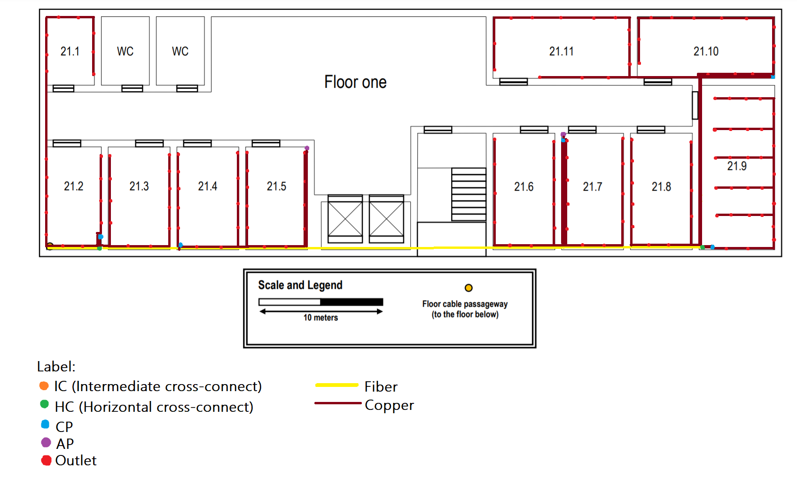

RCOMP 2020-2021 Project - Sprint 1 - Member 1190811 folder
===========================================

Building 2
-------------------------------------
##First Floor


================
Fiber
-------------------------
5 meters (HC1)
52 meters (HC2)


TOTAL FIBER = 57 meters 
---------------------
Copper
-----------------------
* Copper to the CP'S:
* 1 meters (CP1.a)
* 7 meters (CP1.b)
* 1 meters (CP2.a)
* 20 meters (CP2.b)
* 18 meters (CP2.c)


Total meters to CP'S = 47 meters 

----------------
* 21.1 (goes up and down in the Wall into the roof, 6 meters in total)
* 26 meters (1º outlet)
* 27 meters (2º outlet)
* 28 meters (3º outlet)
* 30 meters (4º outlet)
* 31 meters (5º outlet)
* 33 meters (6º outlet)
* 34 meters (7º outlet)
* 35 meters (8º outlet)

TOTAL COPPER = 244 meters 
-----------------------
* 21.2
* 13 meters (1º outlet)
* 11 meters (2º outlet)
* 9 meters (3º outlet)
* 8 meters (4º outlet)
* 7 meters (5º outlet)
* 5 meters (6º outlet)
* 3 meters (7º outlet)
* 1 meters (8º outlet)
* 3 meters (9º outlet)
* 5 meters (10º outlet)
* 7 meters (11º outlet)

TOTAL COPPER = 72 meters 
-------------------------
* 21.3 (goes up and down in the Wall into the roof, 6 meters in total)
(2 meters from the CP do CP)
* 16 meters (1º outlet)
* 14 meters (2º outlet)
* 12 meters (3º outlet)
* 10 meters (4º outlet)
* 10 meters (5º outlet)
* 12 meters (6º outlet)
* 14 meters (7º outlet)
* 16 meters (8º outlet)
* 18 meters (9º outlet)
* 19 meters (10º outlet)
* 20 meters (11º outlet)

TOTAL COPPER = 161 meters 
----------------------------
* 21.4
* 2 meters (1º outlet)
* 4 meters (2º outlet)
* 6 meters (3º outlet)
* 7 meters (4º outlet)
* 8 meters (5º outlet)
* 2 meters (6º outlet)
* 4 meters (7º outlet)
* 6 meters (8º outlet)
* 8 meters (9º outlet)
* 10 meters (10º outlet)
* 12 meters (11º outlet)

TOTAL COPPER = 69 meters 
--------------------------------
* 21.5 (goes up and down in the Wall into the roof, 6 meters in total)
* 20 meters (1º outlet)
* 19 meters (2º outlet)
* 17 meters (3º outlet)
* 15 meters (4º outlet)
* 13 meters (5º outlet)
* 13 meters (6º outlet)
* 15 meters (7º outlet)
* 17 meters (8º outlet)
* 19 meters (9º outlet)
* 21 meters (10º outlet) 
* 23 meters (11º outlet)
* 26 meters (AP)

TOTAL COPPER = 218 meters 
-----------------------------
* 21.6
(top left corner)
(goes up and down in the Wall into the roof, 6 meters in total)
* 30 meters (1º outlet)
* 28 meters (2º outlet)
* 26 meters (3º outlet)
* 24 meters (4º outlet)
* 21 meters (5º outlet)
* 19 meters (6º outlet)
* 17 meters (7º outlet)
* 19 meters (8º outlet)
* 21 meters (9º outlet)
* 23 meters (10º outlet)
* 24 meters (11º outlet)

TOTAL COPPER = 252 meters 
------------------------------
* 21.7
(top left corner)
* 0,5 meters (AP)
* 0,5 meters (1º outlet)
* 1 meters (2º outlet)
* 3 meters (3º outlet)
* 5 meters (4º outlet)
* 7 meters (5º outlet)
* 11 meters (6º outlet)
* 13 meters (7º outlet)
* 16 meters (8º outlet)
*  18 meters (9 ºoutlet) 
* 20 meters (10º outlet)
* 22 meters (11º outlet)

TOTAL COPPER = 117 meters 
------------------------------
* 21.8
(top left corner, reads form the left to bottom and then to the right and then going up)
(goes up and down in the Wall into the roof, 6 meters in total)
* 20 meters (1º outlet)
* 18 meters (2º outlet)
* 16 meters (3º outlet)
* 15 meters (4º outlet)
* 14 meters (5º outlet)
* 11 meters (6º outlet)
* 9 meters (7º outlet)
* 10 meters (8º outlet)
* 12 meters (9º outlet)
* 14 meters (10º outlet)
* 16 meters (11º outlet)

TOTAL COPPER = 155 meters 
--------------------------
* 21.9
(bottom left corner)
* 1 meters (1º outlet)
* 3 meters (2º outlet)
* 6 meters (3º outlet)
* 7 meters (4º outlet)
* 9 meters (5º outlet)
* 10 meters (6º outlet)
* 11 meters (7º outlet)
* 12 meters (8º outlet)
* 9 meters (9º outlet)
* 11 meters (10º outlet)
* 12 meters (11º outlet)
* 13 meters (12º outlet)
* 14 meters (13º outlet)
* 11 meters (14º outlet)
* 13 meters (15º outlet)
* 14 meters (16º outlet)
* 15 meters (17º outlet)
* 16 meters (18º outlet)
* 13 meters (19º outlet)
* 15 meters (20º outlet)
* 16 meters (21º outlet)
* 17 meters (22º outlet)
* 18 meters (23º outlet)
* 16 meters (24ª outlet)
* 18 meters (25º outlet)
* 19 meters (26º outlet)
* 20 meters (27º outlet)
* 21 meters (28º outlet)

TOTAL COPPER = 360 meters 
--------------------------
* 21.10
(read from the left to the right)
* 19 meters (1º outlet)
* 17 meters (2º outlet)
* 14 meters (3º outlet)
* 13 meters (4º outlet)
* 12 meters (5º outlet)
* 10 meters (6º outlet)
* 8 meters (7º outlet)
* 4 meters (8º outlet)
* 3 meters (9º outlet)
* 1 meters (10º outlet)

TOTAL COPPER = 101 meters 
--------------------------------------
* 21.11
(read from the left to the right)
(goes up and down in the Wall into the roof, 6 meters in total)
* 36 meters (1º outlet)
* 34 meters (2º outlet)
* 31 meters (3º outlet)
* 30 meters (4º outlet)
* 28 meters (5º outlet)
* 26 meters (6º outlet)
* 25 meters (7º outlet)
* 23 meters (8º outlet)
* 22 meters (9º outlet)
* 20 meters (10º outlet)
* 18 meters (11º outlet)
* 20 meters (12º outlet)
* 23 meters (13º outlet)

TOTAL COPPER = 336 meters 

TOTAL COPPER FINAL = 2112 meters 


