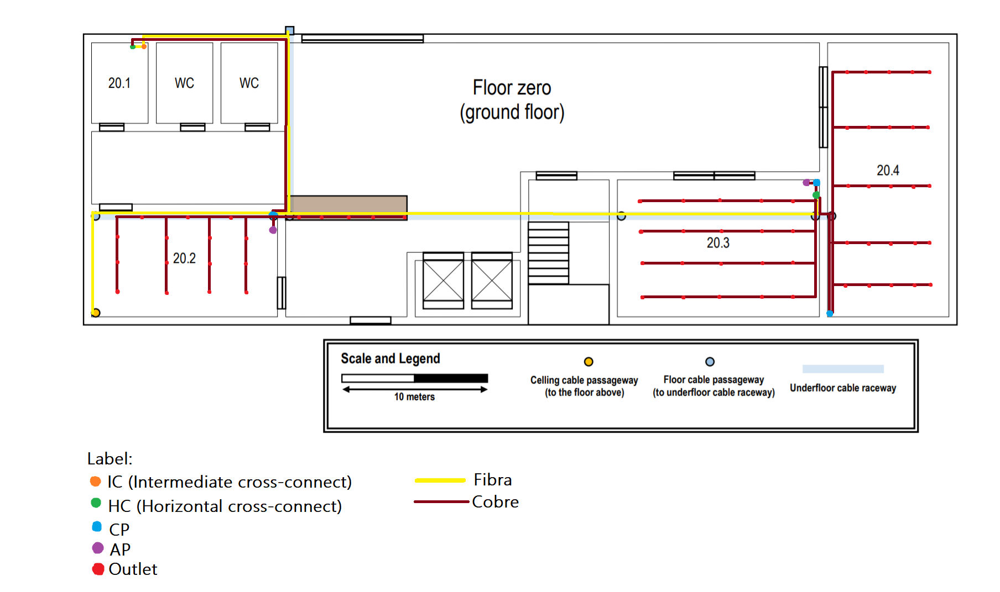
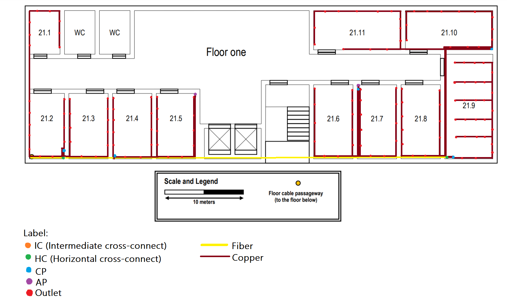

RCOMP 2020-2021 Project - Sprint 1 - Member 1190811 folder
===========================================

Building 2
-------------------------------------


-------------------------------------
## Ground Floor


|Rooms	| Area(m^2)	|Outlets	|
|:---	|:----:	|---:	|
|20.1	|12,5	|0	|
|20.2	|50	|15	|
|20.3	|75	|20	|
|20.4	|100	|25	|
|Desk	|unkown	|5	|
|Total	|1200m	|65	|

## First Floor



|Rooms	| Area(m^2)	|Outlets	|
|:---	|:----:	|---:	|
|21.1		|25	|8	|
|21.2/3/4/5 |50	| 11	|
|21.6/7/8	|60	| 12	| 
|21.9		|105| 28|
|21.10/11 	|65	|13	|
|Total	|1200m	|142|

--------------------------------------
## IC

One IC by building. I am trying to find a place to settle the IC to provide fully the building.
In the some rooms there was a need to install cable race ways to locate outlets in the middle of the rooms.

##Ground Floor

* Total area: 1200 m^2 (60x20)
* 20.1- 5x2,5 = 12,5 m^2 (4 outlets)
* 20.2- 10x5 = 50 m^2 (10 outlets)
* 20.3 - 10x7,5 = 75 m^2 (15 outlets)
* 20.4 - 5x20 = 100 m^2 (20 outlets)
* WC - 12,5 m^2

To Grant more outlets to end-users will be added some more outlets in some rooms compared to the minimum outlets.

Area that isn't rooms and WC´s:
Area: 1200 - 262,5 = 937,5 m^2

### HC

One HC by floor with maximum 1000 m^2. We have 1200 m^2, so it will be needed to have 2 HC to facilitate cable management between rooms. Every time that the HC is really close to CP, everything is inside of a closet. This HC could be in another room but it was determined this way to don't ocupy a lot of space in other rooms.

### CP

The CP'S in this floor are located near the HC's and in rooms that can decrease the amount of cables to other areas.

### AP

The AP's on this floor were strategically located to offer Wi-Fi to every cliente in every room possible on the floor. (Empresarial rate in this AP)

### Technique for cable management
The main clables must pass underground

## First Floor

* Total area: 1200 m^2 (60x20)
* 21.1 - (5x5) = 25 m^2 (6 outlets)
* 21.2/3/4/5 - (10x5) = 50 m^2 (11 outlets)
* 21.6/7/8 - (10X6) = 60 m^2 (12 outlets)
* 21.9 - 15x5 = 105 m^2 (28 outlets)
* 21.10/11- (13x5) = 65 m^2 (13 outlets)

To Grant more outlets to end-users i am thinking about to add some more outlets in each room.

Area that isn't rooms and WC´s:
Area:  1200 - 640 = 560 m^2 

### HC

One HC by floor. We have 1200 m^2, so i will think if we need to have 2 HC to facilitate cable management between rooms. Every time that the HC is really close to CP, everything is inside of a closet.


### CP

The CP'S in this floor are located near the HC's and in rooms that can decrease the amount of cables to other areas, or areas where was a high density of outlets.

### AP

The AP's on this floor were strategically located to offer Wi-Fi to every cliente in every room possible on the floor. (Business type of AP)

### Technique for cable management

The space over the dropped ceiling is perfect to install cable raceways, placed 2.5 meters from the ground. The ceiling height on this floor is 3 meters.

## Cables measurment

* [Cabbles Ground Floor](Cabbles1/Cabbles1.md)
* [Cabbles First Floor](Cabbles2/Cabbles2.md)

## Inventory

### Ground Floor

* 1 IC
* 2 HC's 
* 2 CP's
* 2 AP's
* 65 outlets
* 144 meters Fiber cabble
* 897 meters Copper cabble (CAT6)
* 75 Patch Coords
* 3 Switchs 24 ports 
* 1 Switch 48 ports
* 3 Patch Panels 24 ports
* 1 Patch Panel 48 ports

### First Floor

* 2 HC's
* 5 CP's
* 2 AP's
* 142 outlets
* 57 meters Fiber cabble
* 2112 meters Copper cabble (CAT6)
* 144 Patch Coords
* 4 Switch 48 ports
* 1 Switch 24 ports
* 4 Patch Panels 48 ports
* 1 Patch Panel 24 ports
























