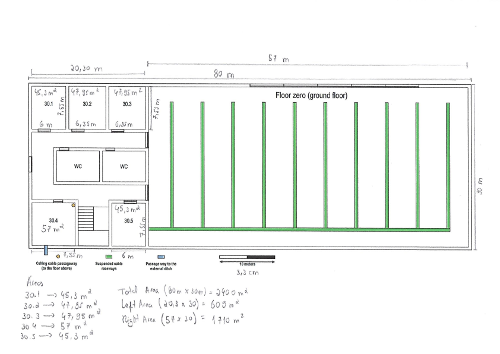
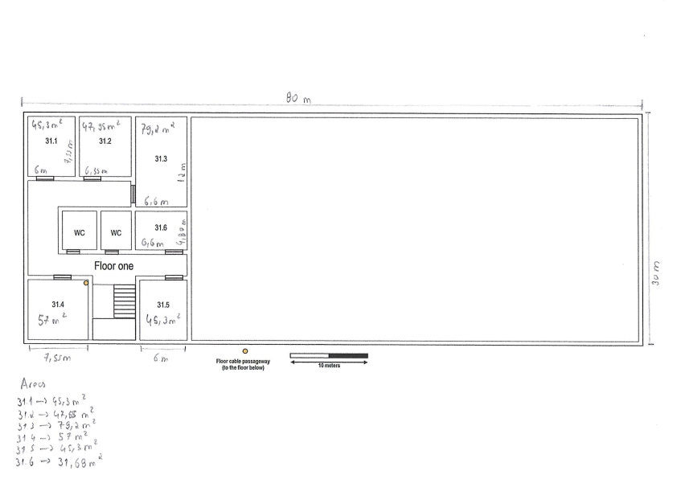
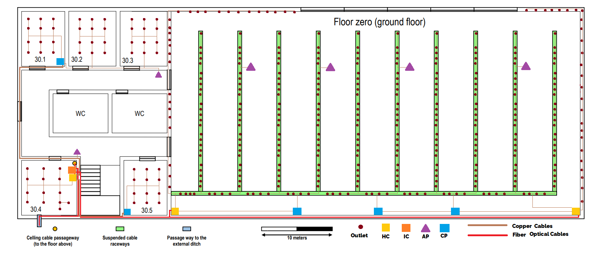
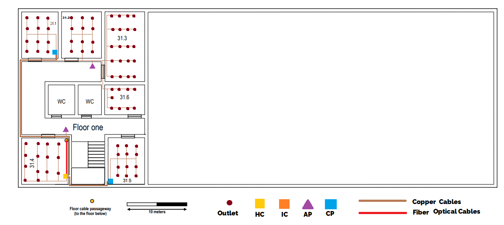

RCOMP 2020-2021 Project - Sprint 1 - Member 1191419 folder
===========================================
The owner of this folder (member number 1191419) will commit here all the outcomes (results/artifacts/products)		       of his/her work during sprint 1. This may encompass any kind of standard file types.

------------------------------------------------------------------------
José Diogo Maia

# Building 3 #

Note: A full wireless LAN (Wi-Fi) coverage is required for this
building.

## Floor 0 (ground floor) : ##




* On the left side, common areas are not required to have network outlets, elsewhere the standard number of outlets per area rate is to be used.

* On the suspended cable raceways ( right area), network outlets are to be directly attached and provide a homogenous coverage of the entire open space, following the standard number of outlets per area rate.

* Common areas are not required to have network outlets.

Sizes:

* 80x30m

* Right open area has a single floor
whose height encompasses both left area floors with a  ceiling height of 6.5 meters.

* The left area ceiling height is 3 meters, with a
removable dropped ceiling placed 2.5 meters from the ground.

Areas:

* Total Area : (80x30m) = 2400 m2

* Left Area : (20,30x30) = 609 m2

* Right Area : (57x30) = 1 710 m2

* Room *30.1* : (6x7,55m) = 45,30 m2

* Room *30.2* : (6,35x7,55m) = 48 m2

* Room *30.3* : (6,35x7,55m) = 48 m2

* Room *30.4* : (7,55x7,55m) = 57 m2

* Room *30.5* : (6x7,55m) = 45,30 m2

* Sum of the area of ​​all rooms = 243,60 m2

* Common Area (Stairs, WC, Hall ) = 600 - (243,60) = 356,40 m2

## Floor 1 (first floor) : ##




* On the left side, common areas are not required to have network outlets, elsewhere the standard number of outlets per area rate is to be used.

* Common areas are not required to have network outlets.

Sizes:

* The left area ceiling height is 3 meters, with a
removable dropped ceiling placed 2.5 meters from the ground.

Areas:

* Left Area : (20,30x30) = 609 m2

* Room *31.1* : (6x7,55m) = 45,30 m2

* Room *31.2* : (6,35x7,55) = 48 m2

* Room *31.3* : (6,35x12) = 76,20 m2

* Room *31.4* : (7,55x7,55) =  57 m2

* Room *31.5* : (6x7,55) = 45,30 m2

* Room *31.6* : (6,6x4,80) = 31,70 m2

* Sum of the area of ​​all rooms = 274,80 m2

* Common Area (Stairs, WC, Hall ) = 600 - (274,80) = 325,20 m2

## Standard outlets needed per area : ##

Note : 2 outlets per 10 m2.

Note:  I'm adding 2 outlets per room for future updates.

**Ground floor :**

* 30.1 -> 12 outlets

* 30.2 -> 12 outlets

* 30.3 -> 12 outlets

* 30.4 -> 14 outlets

* 30.5 -> 12 outlets

* Open area -> 344 outlets

**Floor One :**

* 31.1 -> 12 outlets

* 31.2 -> 12 outlets

* 31.3 -> 20 outlets

* 31.4 -> 14 outlets

* 31.5 -> 12 outlets

* 31.6 -> 9 outlets

# Cabling : #

The cable we are using is CAT6 RJ45. There are more type of cables but also more expensive. In this Sprint, CAT6 RJ45 is perfect. In the entire project it has the T568A pattern.

## Floor 0 (ground floor) : ##




As we can see above, the number of outlets placed was according to the standart ( 2 per 10 m2), plus 2 in all rooms for safety. Also, all over this floor the display of the outlets is made in a way to assure that any user has an outlet avaible in a 3 meters radius, everywere but in the common areas (halls, stairs and WC). 

Regarding the left area, since it has roughly 610 m2 there's only need for 1 Horizontal cross-connect(HC). This HC is placed in the room 30.4 where the optical fibre enters the building and where's also the Intermediate cross-connect (IC) . 
 
In this area were placed 2 Access Points (AP) ,not only to cover all the left area but also to provide good quality of wi-fi to all the users, compensating any possible disturbance of the signal due to walls. 

Were used 2 Consolidation Points (CP), to assure that no cable is greater then 80 meters ,free pressure and lower the density of cables leaving the HC. One is placed in room 30.5 and another in 30.1 wich provides outlets to all the rooms on the top.

 With this, we can guarantee that in a straight line no cable is greater than 90 meters and no outlet is further than 80 meters from the HC.

------------------------------------------------------------------------------------------------------------------------

Regarding the right area that has 1 710 m2, there's the need for 2 HC. One placed in the bottom left corner of the room and the other in the bottom right corner, to homogeneously cover all the area. Due to the high outlets density and to control cable sizing, 3 CP were placed, one connected to the left HC and the other two on the right HC. Each CP handles two vertical cable raceways and 8 outlets on the horizontal cable raceway. 

In each vertical cable raceway were directly attached 25 outlets and in each vertical railway interval 4 , this way they are not too filled up, providing free space in the raceway for easier access, future upgrades and repairs, and still giving a homogenous coverage of the entire area.

To provide outlets not only by the raceways, 54 outlets were also placed in the right, left and top wall.

Knowing that only 2 AP would cover the area, we dicided to place 4 Access Points to assure a good quality of wi-fi since this space will be occupied by a lot of people (many of them with multiple devices). 

 With this, we can assure that in a straight line no cable is greater than 90 meters and no outlet is further than 80 meters from the HC.

Copper per Room: 

* 30.1 -> 72,50 m 
* 30.2 -> 134,50 m
* 30.3 -> 221,50 m
* 30.4 -> 89,75 m
* 30.5 -> 72,50 m
* Right Area -> 5 941,75 m

This floor contains:

* 1 Intermediate cross-connect (IC)
* 3 Horizontal cross-connect (HC)
* 5 Consolidation Point (CP) 
* 6 Access Point (AC) 
* 6 switches of 24 ports
* 8 switches of 48 ports
* 6 patch panels of 24 ports
* 8 patch panels of 48 ports
* 406 Outlets (RJ45)
* 7 Fiber optical cables
* 196,50 m of Fiber optical cable 
* 420 Copper cables
* 6635,45 m of Copper cable

 The _total_ length of cable needed in this floor is 6 635,45 m of cooper cable, that we will round up to 6 800 m to assure that the cable is enough even if something goes wrong and some cable is wasted.

 The _total_ lenght of fiber optical cable needed in this floor is 196,50 m. As we did with the copper cable we will round up the fiber cable to 220 m for safety.

## Floor 1 (first floor) : ##




Like the ground floor the outlets were placed following the same tactic (an outlet avaible in a 3 meters radius, everywere but in the common areas and 2 per 10 m2).

Since this area has roughly 610 m2 there's only need for 1 Horizontal cross-connect(HC). This HC is placed in the room 31.4 were the fibre enters the floor from the floor below.

In this area were placed 2 Access Points (AP) ,not only to cover all area but also to provide good quality of wi-fi to all the users in there, compensating any possible disturbance of the signal due to walls. 

For the same reason as in the floor below , were used 2 Consolidation Points (CP). One is placed in room 31.5 and other in room 31.1 wich provides outlets to all the rooms on the top.

 With this, we can assure that in a straight line no cable is greater than 90 meters and no outlet is further than 80 meters from the HC.

Copper per Room: 

* 31.1 -> 72,50 m 
* 31.2 -> 134,50 m
* 31.3 -> 308 m 
* 31.4 -> 105 m
* 31.5 -> 72,50 m
* 31.6 -> 170 m

This floor contains:

* 1 Horizontal cross-connect (HC)
* 2 Consolidation Point (CP) 
* 2 Access Point (AC) 
* 3 switches of 24 ports
* 1 switches of 48 ports
* 3 patch panels of 24 ports
* 1 patch panels of 48 ports
* 79 Outlets (RJ45)
* 1 Fiber optical cable
* 9 m of Fiber optical cable ( 3m that are the height)
* 84 Copper cables
* 920,45 m of Copper cable

 The _total_ length of cable needed in this floor is 920,45 m of cooper cable, that we will round up to 1 000 m to assure that the cable is enough even if something goes wrong and some cable is wasted (for safety).

 The _total_ lenght of fiber optical cable needed in this floor is 9 m. As we did with the copper cable we will round up the fiber cable to 15 m for safety.

# Total inventory : #

* 1 Intermediate cross-connect (IC)
* 4 Horizontal cross-connect (HC)
* 7 Consolidation Point (CP) 
* 8 Access Point (AC) 
* 9 switches of 24 ports
* 9 switches of 48 ports
* 9 patch panels of 24 ports
* 9 patch panels of 48 ports
* 485 Outlets (RJ45)
* 8 Fiber Optical Cables
* 235 m of Fiber optical cable 
* 504 copper cables
* 7 800 m of Copper cable

 
















