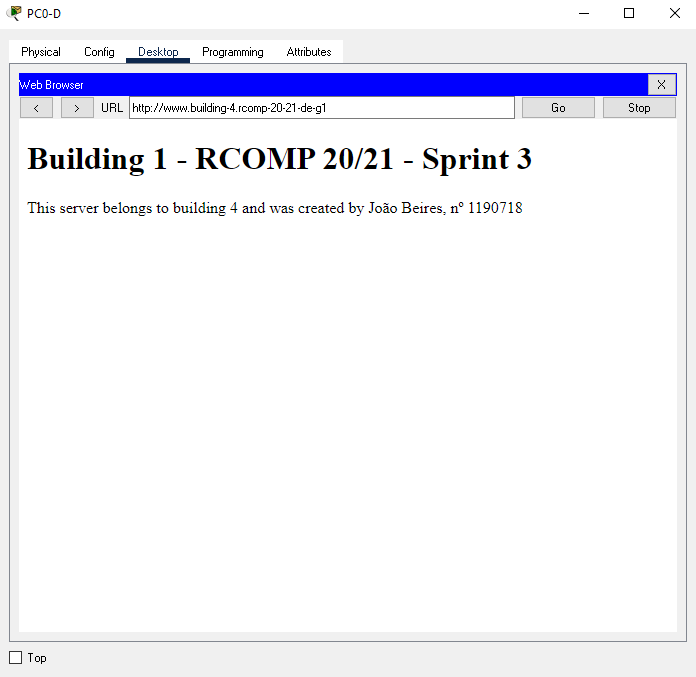
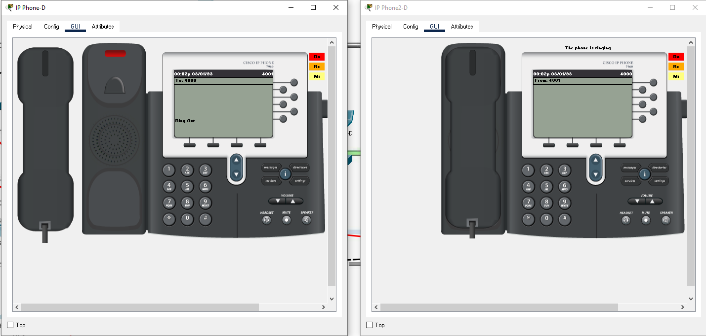

RCOMP 2020-2021 Project - Sprint 3 - Member 1190718 folder
===========================================

João Beires

# Building 4 #

Note: All IP Subnetting info can be found in the sprint 2 README.md file.

# Commands used in the Sprint by topic

## 1. OSPF dynamic routing

-> Static routing will no longer be used, so on every router, the existing static routing tables were
   erased;
   
-> The OSPF was established at Building 4 router (code shown) and in all routers. Area 4 was the area id chosen for building 4.

* router ospf 4
* log-adjacency-changes
* network 10.122.224.0 0.0.0.127 area 0
* network 10.122.231.128 0.0.0.63 area 4
* network 10.122.231.64 0.0.0.63 area 4
* network 10.122.231.0 0.0.0.63 area 4
* network 10.122.230.0 0.0.0.255 area 4
* network 10.122.231.192 0.0.0.31 area 4

## 2. HTTP servers

-> A new server was added to the local DMZ network , with a manually set IPv4 address. The following HTML page is the one implemented :



## 3. DHCPv4 service

####Ground floor

* ip dhcp pool ground-floorD
* network 10.122.231.128 255.255.255.192
* default-router 10.122.231.129
* dns-server 10.122.230.1
* domain-name building-4.rcomp-20-21-de-g1

####First floor

* ip dhcp pool first-floorD
* network 10.122.231.64 255.255.255.192
* default-router 10.122.231.65
* dns-server 10.122.230.1
* domain-name building-4.rcomp-20-21-de-g1

####WIFI

* ip dhcp pool WIFI-D
* network 10.122.231.0 255.255.255.192
* default-router 10.122.231.1
* dns-server 10.122.230.1
* domain-name building-4.rcomp-20-21-de-g1

####VoIP

* ip dhcp pool VOIP-D
* network 10.122.231.192 255.255.255.224
* default-router 10.122.231.193
* option 150 ip 10.122.231.193
* dns-server 10.122.230.1
* domain-name building-4.rcomp-20-21-de-g1

## 4. VoIP service

-> In each building there are 2 phones, one in the ground floor and other in the firt floor. Both phones comunicate between 
their building and all other buildings. For this building we have phone : 4000 and phone : 4001.

* dial-peer voice 10 voip
* destination-pattern 1...
* session target ipv4:10.122.224.1
* dial-peer voice 20 voip
* destination-pattern 2...
* session target ipv4:10.122.224.4
* dial-peer voice 30 voip
* destination-pattern 3...
* session target ipv4:10.122.224.3
* telephony-service
* max-ephones 2
* max-dn 2
* ip source-address 10.122.231.193 port 2000
* auto assign 1 to 2
* ephone-dn 1
* number 4000
* ephone-dn 2
* number 4001



## 6. NAT (Network Address Translation)

* ip nat inside source static udp 10.122.230.2 53 10.122.224.2 53 
* ip nat inside source static tcp 10.122.230.2 53 10.122.224.2 53 
* ip nat inside source static tcp 10.122.230.3 443 10.122.224.2 443 
* ip nat inside source static tcp 10.122.230.3 80 10.122.224.2 80
