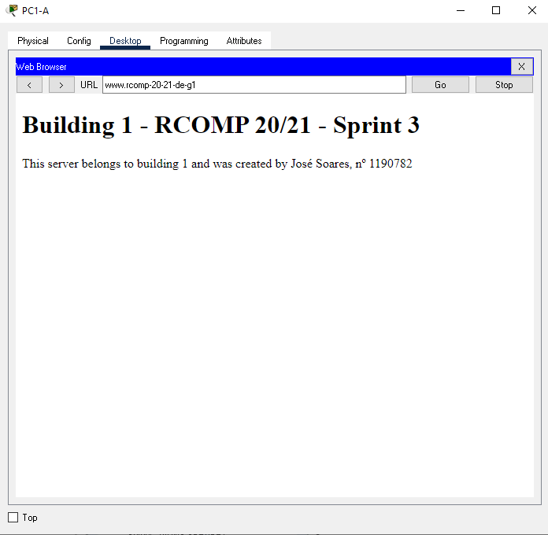

RCOMP 2020-2021 Project - Sprint 3 - Member 1190782 folder
===========================================
		     
José Soares

# Building 1 #

Note: All IP Subnetting info can be found in the sprint 2 README.md file.

# Commands used in the Sprint by topic

## 1. OSPF dynamic routing

-> Static routing will no longer be used, so on every router, the existing static routing tables were
   erased, with the exception of the default route established in this building router;
   
-> The OSPF was established at Building 1 router (code shown) and in all routers. Area 1 was the area id chosen for building 1.

* router ospf 1
* log-adjacency-changes
* network 10.122.224.0 0.0.0.127 area 0
* network 10.122.225.0 0.0.0.63 area 1
* network 10.122.225.64 0.0.0.63 area 1
* network 10.122.225.128 0.0.0.31 area 1
* network 10.122.224.128 0.0.0.127 area 1
* network 10.122.225.160 0.0.0.31 area 1

## 2. HTTP servers

-> A new server was added to the local DMZ network , with a manually set IPv4 address. The following HTML page is the one implemented :

## 3. DHCPv4 service

####Ground floor

* ip dhcp pool ground-floorA
* network 10.122.225.0 255.255.255.192
* default-router 10.122.225.1
* dns-server 10.122.227.129
* domain-name rcomp-20-21-de-g1

####First floor

* ip dhcp pool first-floorA
* network 10.122.225.64 255.255.255.192
* default-router 10.122.225.65
* dns-server 10.122.227.129
* domain-name rcomp-20-21-de-g1

####WIFI

* ip dhcp pool WIFI-A
* network 10.122.225.128 255.255.255.224
* default-router 10.122.225.129
* dns-server 10.122.227.129
* domain-name rcomp-20-21-de-g1

####VoIP

* ip dhcp pool VOIP-A
* network 10.122.225.160 255.255.255.224
* default-router 10.122.225.161
* option 150 ip 10.122.225.161
* dns-server 10.122.227.129
* domain-name rcomp-20-21-de-g1

## 4. VoIP service

-> In each building there are 2 phones, one in the ground floor and other in the firt floor. Both phones comunicate between 
their building and all other buildings. For this building we have phone : 1000 and phone : 1001.

* dial-peer voice 20 voip
* destination-pattern 2...
* session target ipv4:10.122.224.4
* dial-peer voice 30 voip
* destination-pattern 3...
* session target ipv4:10.122.224.3
* dial-peer voice 40 voip
* destination-pattern 4...
* session target ipv4:10.122.224.2
* telephony-service
* max-ephones 2
* max-dn 2
* ip source-address 10.122.225.161 port 2000
* auto assign 1 to 2
* ephone-dn 1
* number 1000
* ephone-dn 2
* number 1001

## 6. NAT (Network Address Translation)

* ip nat inside source static udp 10.122.224.130 53 10.122.224.1 53 
* ip nat inside source static tcp 10.122.224.130 53 10.122.224.1 53 
* ip nat inside source static tcp 10.122.224.131 443 10.122.224.1 443 
* ip nat inside source static tcp 10.122.224.131 80 10.122.224.1 80 